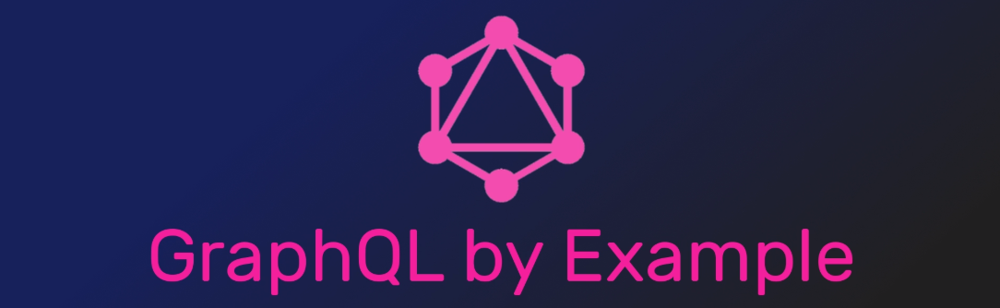

# graphql-fundamentals



GraphQL is bit like SQL, but for querying web APIs rather than databases. You can ask for what you need, get exactly that. Client has full control over which data it wants from the server. It resolves over fetching data. Graphql can get many resources in a single request, so that solves under fetching data. Automaticly generate describes your API. Graphql has powerful developer tool

- [graphql.js doc](https://graphql.org/graphql-js/)
- [graphql advantages vs disvantages](https://www.robinwieruch.de/why-graphql-advantages-disadvantages-alternatives#graphql-advantages)
- [graphql.js github repository](https://github.com/graphql/graphql-js)

- [apollo.js doc](https://www.apollographql.com/docs)
- [Schemas and types for graphql](https://graphql.org/learn/schema)

## Simple example of how to make a GraphQL request over HTTP.

- [./examples/simple/server/index.js](./examples/simple/server/index.js)
- [./examples/simple/client/index.html](./examples/simple/client/index.html)

### Defining a schema

```js
const { gql } = require('apollo-server');

const typeDefs = gql`
  type Query {
    greeting: String
  }
`;

console.log(typeDefs);
```

console output:

```js
{ kind: 'Document',
  definitions:
   [ { kind: 'ObjectTypeDefinition',
       description: undefined,
       name: [Object],
       interfaces: [],
       directives: [],
       fields: [Array] } ],
  loc: { start: 0, end: 41 } }
```

This object represents an abstract syntax tree of the Graphql.

### Implementing resolver functions

be careful! for `new ApolloServer()` you can define only a configuration object with our `typeDefs` and `resolvers`.

```js
const resolvers = {
  Query: {
    greeting: () => 'Hello GraphQl World!'
  }
};

const server = new ApolloServer({ typeDefs, resolvers });
server
  .listen({ port: 9000 })
  .then(serverInfo =>
    console.log(
      `Server running at ${serverInfo.url}`,
      `\n${JSON.stringify(serverInfo)}`
    )
  );
```

### ServerInfo argument return object with properties:

```js
{
  "address": "::",
  "family": "IPv6",
  "port": 9000,
  "server": {
    "_events": {},
    "_eventsCount": 5,
    "_connections": 0,
    "_handle": {
      "reading": false,
      "onread": null
    },
    "_usingWorkers": false,
    "_workers": [],
    "_unref": false,
    "allowHalfOpen": true,
    "pauseOnConnect": false,
    "httpAllowHalfOpen": false,
    "timeout": 120000,
    "keepAliveTimeout": 5000,
    "maxHeadersCount": null,
    "headersTimeout": 40000,
    "_connectionKey": "6::::9000"
  },
  "subscriptionsPath": "/graphql",
  "url": "http://localhost:9000/",
  "subscriptionsUrl": "ws://localhost:9000/graphql"
}
```

<hr>

## [Advanced example](./docs/advanced/intro.md)

- [./examples/advanced/client](./examples/advanced/client)
- [./examples/advanced/server](./examples/advanced/server)
