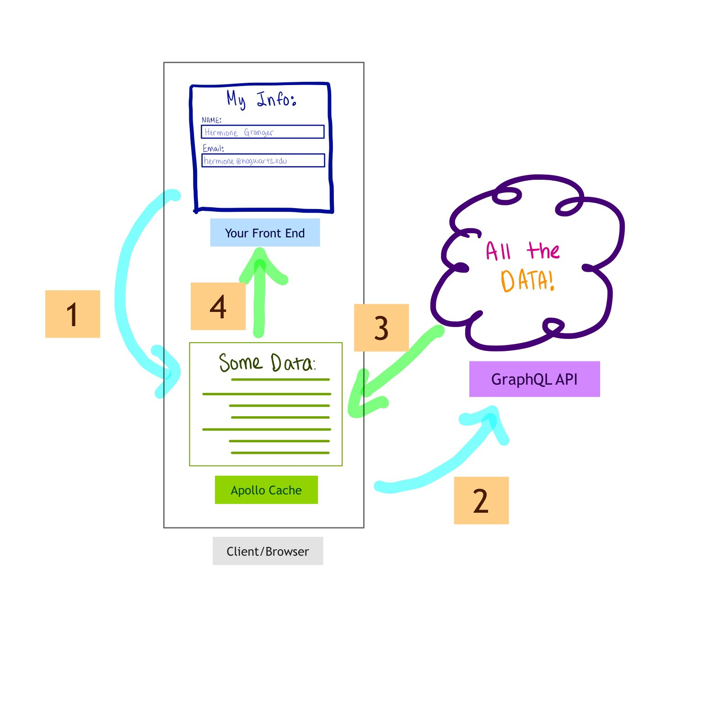

### [Apollo client](https://www.apollographql.com/docs/react/get-started/)

[back to homepage](../../README.md)

#### 1. Setup

First, let's install some packages!<br>

```
npm install apollo-boost graphql
```

If you want you can check dependecies by command:<br>

```
npm view apollo-boost dependencies
```

After installed apollo-boost we can start in the [requests.js](./examples/advanced/client/src/requests.js) by importing ApolloClient from the `apollo-boost` module and then we can create a new instance of ApolloClient

```js
import { ApolloClient, HttpClient, InMemoryCache } from 'apollo-boost';
import { getAccessToken, isLoggedIn } from './auth';

const endpointURL = 'http://localhost:9000/graphql';

const client = new ApolloClient({
	link: new HttpClient({ uri: endpointURL, cache: new InMemoryCache() })
});
```

#### 2. Queries with apollo client

Let's replace the call to our graphqlRequest function in `loadJobs()` by using our new client instead the `client` object has a `query` method that we can use to send a request this takes an object with some properties the main one is `query` that is the GraphQL query to send now, we already have a `query` variable defined here so that's what we'll send however we need to make a small change because this query currently is just a string but with Apollo Client we need to send a structured object that is the result of parsing this query using the GraphQL library to make this step easy we can import a function here at the top we can call this function `gql` to keep it short. With `gql` we can use it as a `tag function` that is we write `gql` before the backtick-delimited string.<br>

if you haven't seen this syntax before tag functions are one of the features introduced in ES6 together with template strings it basically means that this template string will be processed by the gql function and what the gql function does is effectively parsing this string into an object that represents the GraphQL query that's what the client.query method expects now, the query method returns a Promise. It's a Promise that resolves to an object that has a few properties: "data", "errors", etc. it's basically an object representing the GraphQL response.

```js
import { ApolloClient, HttpClient, InMemoryCache, gql } from 'apollo-boost';
import { getAccessToken, isLoggedIn } from './auth';

const endpointURL = 'http://localhost:9000/graphql';

const client = new ApolloClient({
	link: new HttpClient({ uri: endpointURL, cache: new InMemoryCache() })
});

export async function loadJobs() {
	// const query = `
	//   {
	//     jobs {
	//       id
	//       title
	//       company {
	//         id
	//         name
	//       }
	//     }
	//   }
	// `;
	// const { jobs } = await graphqlRequest(query);
	// return jobs;
	query = gql`
		{
			jobs {
				id
				title
				company {
					id
					name
				}
			}
		}
	`;
	const {
		data: { jobs } // <-- using destructuring, we can extract a jobs from data object
	} = await client.query({ query });
	return jobs;
}
```

let's go update the other functions `loadJob()` where we using another option called `variable`, so we can use another option called `variable` which should be object containing the variable values `id`

```js
export async function loadJob(id) {
	// const query = `
	// 	query JobQuery($id: ID!) {
	// 		job(id: $id) {
	// 			id
	// 			title
	// 			description
	// 			company {
	// 				id
	// 				name
	// 			}
	// 		}
	// 	}
	// `;
	// const { job } = await graphqlRequest(query, { id });
	// return job;
	const query = gql`
		query JobQuery($id: ID!) {
			job(id: $id) {
				id
				title
				description
				company {
					id
					name
				}
			}
		}
	`;
	const {
		data: { job } // <-- using destructuring, we can extract a job from data object
	} = await client.query({ query, variables: { id } });
	return job;
}
```

The next one will be loadCompany it's the same process.

```js
export async function loadCompany(id) {
	// const query = `
	// 	query CompanyQuery($id: ID!) {
	// 		company(id: $id) {
	// 			id
	// 			name
	// 			description
	// 			jobs {
	// 				id
	// 				title
	// 			}
	// 		}
	// 	}
	// `;
	// const { company } = await graphqlRequest(query, { id });
	// return company;
	const query = gql`
		query CompanyQuery($id: ID!) {
			company(id: $id) {
				id
				name
				description
				jobs {
					id
					title
				}
			}
		}
	`;
	const {
		data: { company } // <-- using destructuring, we can extract a job from data object
	} = await client.query({ query, variables: { id } });
	return company;
}
```

The final request we need to change is the `createJob` mutation once again we want to use the `gql` tag function in this case it's a mutation and not strictly a query but it can still be parsed as a GraphQL object. Then we'll make the new request that returns a data object containing a `job` returned asynchronously by the client instead of `query` we call the `mutate` method as usual this takes a config object and in this case we want to set the `mutation` property as it happens we already have a local variable called mutation. We'll also need some `variables` containing the `input` object to be created.

```js
export async function createJob(input) {
	// const mutation = `mutation CreateJob($input: CreateJobInput) {
	//     job: createJob(input: $input) {
	//       id
	//       title
	//       company {
	//         id
	//         name
	//       }
	//     }
	//   }
	// `;
	// const { job } = await graphqlRequest(mutation, { input });
	// return job;
	const mutation = gql`
		mutation CreateJob($input: CreateJobInput) {
			job: createJob(input: $input) {
				id
				title
				company {
					id
					name
				}
			}
		}
	`;
	const {
		data: { job }
	} = await client.mutate({ mutation, variables: { input } });
	return job;
}
```

#### 3. Authentication with ApolloLink

If we try to post a new job that doesn't work. We can see in the console error saying `Unauthorized` which suggests we may be missing the authentication details in the request. In our old graphqlRequest function if the user is logged in then we set the authorization header so we need a way to do the same when using the Apollo Client the client is configured to use an HttpLink to communicate with the server we need a way to customise the behaviour of this `link` and the way we can do that is by using the ApolloLink class that first we need to import of course with this we can modify the link configuration to be ApolloLink.from and then we pass an array that can contain multiple ApolloLink instances at the moment this array only contains HttpLink but we can now add another link implementation let's call it `authLink` since it deals with authentication and this will be a new ApolloLink instance this takes as argument a function with two parameters the `operation` that is the GraphQL query or mutation to be executed and `forward` that I'll explain in a second so this is a function with a body as the last statement we need to make sure to return forward(operation) so `forward` is a function that allows us to chain multiple steps together we'll do something in this authLink step but at the end of it forward the operation to the next step that's necessary because the way we'll use this authLink is by adding it to this array, before HttpLink so this means our authLink code will be executed first and then the HttpLink that will actually make the HTTP request by adding our authLink before HttpLink we can prepare the request before it gets sent and by preparing the request I mean setting the authorization header like we were doing in the graphRequest function so let's copy the old code since we'll need something very similar and paste it into our authLink the way we set the header here will be slightly different though but let's keep the old line as a reference on the `operation` object we can call `setContext` and pass an object with properties to be used in the request here we can set the HTTP headers and this is where we can put our `authorization` header with the value being the same as in the old code so `Bearer` plus the access token at this point we can remove the old line and that's it we're setting the header in the operation context which will be used by the HttpLink when making the actual HTTP request. We can remove `graphqlRequest()` function because it's not used any more we're now using the Apollo "client" everywhere.

```js
import {
	ApolloClient,
	ApolloLink,
	HttpLink,
	InMemoryCache,
	gql
} from 'apollo-boost';
import { getAccessToken, isLoggedIn } from './auth';

const endpointURL = 'http://localhost:9000/graphql';

const authLink = new ApolloLink({ operation, forward }) => { // <-- here
	if (isLoggedIn()) {
		operation.setContext({
			headers: {
				authorization: `Bearer ${getAccessToken()}`
			}
		});
	}
	return forward(operation) // <-- here
}

const client = new ApolloClient({
	link: ApolloLink.from([authLink, new HttpLink({ uri: endpointURL })]), // <-- here
	cache: new InMemoryCache() // <-- here
});

// async function graphqlRequest(query, variables = {}) {
// 	const request = {
// 		method: 'POST',
// 		headers: { 'content-type': 'application/json' },
// 		body: JSON.stringify({ query, variables })
// 	};
// 	// if (isLoggedIn()) {
// 	// 	request.headers['Authorization'] = `Bearer ${getAccessToken()}`;
// 	// }
// 	const response = await fetch(endpointURL, request);
// 	const responseBody = await response.json();
// 	if (responseBody.errors) {
// 		const message = responseBody.errors.map(error => error.message).join('\n');
// 		throw new Error(message);
// 	}
// 	return responseBody.data;
// }


export async function createJob(input) {
	const mutation = gql`
		mutation CreateJob($input: CreateJobInput) {
			job: createJob(input: $input) {
				id
				title
				company {
					id
					name
				}
			}
		}
	`;
	const {
		data: { job }
	} = await client.mutate({ mutation, variables: { input } });
	return job;
}

export async function loadCompany(id) {
	const query = gql`
		query CompanyQuery($id: ID!) {
			company(id: $id) {
				id
				name
				description
				jobs {
					id
					title
				}
			}
		}
	`;
	const {
		data: { company }
	} = await client.query({ query, variables: { id } });
	return company;
}

export async function loadJob(id) {
	const query = gql`
		query JobQuery($id: ID!) {
			job(id: $id) {
				id
				title
				description
				company {
					id
					name
				}
			}
		}
	`;
	const {
		data: { job }
	} = await client.query({ query, variables: { id } });
	return job;
}

export async function loadJobs() {
	const query = gql`
		{
			jobs {
				id
				title
				company {
					id
					name
				}
			}
		}
	`;
	const {
		data: { jobs }
	} = await client.query({ query });
	return jobs;
}
```

Let's go to test it.

<br>
<br>

#### 4. Caching and [fetch policy](https://medium.com/@galen.corey/understanding-apollo-fetch-policies-705b5ad71980)

The main feature provided by Apollo Client is caching. If you will inspect the network requests and you will filter only `/graphql` requests. If you start by reloading the home page we can see a first GraphQL request where the response contains the `jobs` data.

<br>

How the cache works? The first time we make a certain GraphQL query. It will fetch the data from the server and save it in the cache. If we make the same GraphQL query again. It will simply use the data from the cache without calling the server again. This is the default behaviour with Apollo Client caching is good because it avoids making unnecessary calls to the server however caching also adds some complexity to our application. It's not quite as simple as calling the server every time in some cases using a cache can result in some unexpected behaviours. Sometimes it's good to cache data because it makes your app respond faster by not having to call the server as often but sometimes it's actually better to always fetch fresh data even if that means waiting for a server response which approach is best is something you need to decide for your own application on a case by case basis thankfully it's possible to customise the caching behaviour of Apollo Client to suit your needs.<br>

For example let's see in the [requests.js](../examples/advanced/client/src/requests.js) file and how we can bypass the cache completely when fetching the list of jobs that is in this `loadJobs()` function when we make a query we can pass some additional properties and there is one called `fetchPolicy` the value of `fetchPolicy` can be one of these options:

- the default is `cache-first` which means it will try getting the data from the cache first and only if it doesn't find it in the cache then it will call the server which is exactly the behaviour we've observed so far

<br>

- `cache-and-network` will have Apollo first trying to read data from your cache. If all the data needed to fulfill your query is in the cache then that data will be returned. However, regardless of whether or not the full data is in your cache this fetchPolicy will always execute query with the network interface unlike cache-first which will only execute your query if the query data is not in your cache. This fetch policy optimizes for users getting a quick response while also trying to keep cached data consistent with your server data at the cost of extra network requests.

<br>

- `network-only` it will never return you initial data from the cache. Instead it will always make a request using your network interface to the server. This fetch policy optimizes for data consistency with the server, but at the cost of an instant response to the user when one is available.

<br>

- `no-cache` that means it will never use the cache it will always fetch the data from the server.<br>

Example:

```js
export async function loadJobs() {
	const query = gql`
		{
			jobs {
				id
				title
				company {
					id
					name
				}
			}
		}
	`;
	const {
		data: { jobs }
	} = await client.query({ query, fetchPolicy: 'no-cache' }); // <-- here
	return jobs;
}
```

<br>

- `cache-only` this is the default. It will never execute a query using your network interface. Instead it will always try reading from the cache. If the data for your query does not exist in the cache then an error will be thrown. This fetch policy allows you to only interact with data in your local client cache without making any network requests which keeps your component fast, but means your local data might not be consistent with what is on the server. If you are interested in only interacting with data in your Apollo Client cache also be sure to look at the `readQuery()` and `readFragment()` methods available to you on your ApolloClient instance.

<br>

#### 4. Updating the cache after a mutation
